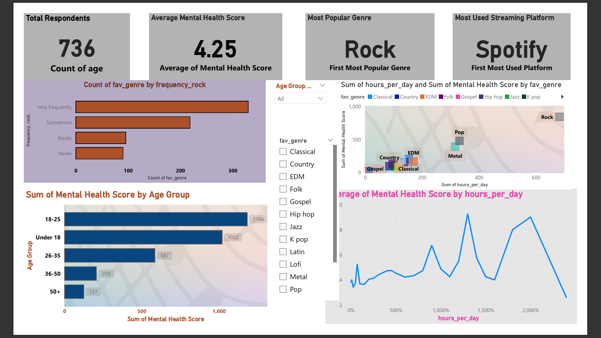

# 🎵 M.X.M.H. Survey Data Analysis & Dashboard Documentation


## 📌 Project Overview
This project analyzes the M.X.M.H. survey dataset to uncover patterns between music preferences, daily listening habits, and mental health indicators.  
The workflow includes:

1. **Data Cleaning & Preprocessing** 📊
2. **Exploratory Data Analysis (EDA)** 🔍
3. **SQL Integration for Querying** 💾
4. **Power BI Dashboard for Visualization** 📈

---

## 🛠 Tools Used
- **Python (Pandas, Seaborn, Matplotlib)**: For data cleaning, EDA, and visualization.
- **SQL**: For efficient querying and data aggregation.
- **Power BI**: For creating an interactive and dynamic dashboard.

---

## 🚀 Key Features & Insights from the Dashboard
### 🔹 Demographic Analysis
- The dashboard highlights the **age distribution** of survey participants.
- Age group segmentation helps identify key demographics engaging with music and reporting mental health factors.

### 🔹 Favorite Genre Insights
- Analyzes **most preferred music genres** across respondents.
- Pop, Rock, and Hip-Hop emerged as the most popular categories.

### 🔹 Streaming Platform Preferences
- Spotify and YouTube dominate the streaming services among participants.
- Provides insights for music marketers about platform-specific trends.

### 🔹 Daily Listening Patterns
- Most respondents listen to music between **1–4 hours per day**.
- Important for businesses targeting ad slots or promoting content.

### 🔹 Mental Health and Music Habits
- Explores correlations between **music listening habits** and **mental health indicators** like anxiety and insomnia.
- Useful for research on music therapy or marketing wellness-focused playlists.
## Folder Structure
```
📂 MXMH-analysis
├── 📄 mxmh_survey_cleaned.csv
├── 📄 MXMH.ipynb
├── 📄 README.md
├── 📄 requirements.txt
└── 📂 assests (for visualizations)
```
## 🚀 How to Use
1. Clone this repository:
   ```bash
   git clone https://github.com/yourusername/spotify-dashboard.git
   ```
2. Open the Power BI file (`MXMH Dashboard.pbix`).
3. Explore the interactive dashboard to analyze trends.

## 💻 My Experience Working on This Project
This project was a fantastic journey, combining my love for **data analytics, SQL, and Power BI**. I enjoyed:

✨ **Uncovering Hidden Trends** – Finding surprising insights in Spotify data.  
✨ **Building a Visually Appealing Dashboard** – Creating an interactive, user-friendly interface.  
✨ **Solving Complex Problems** – Overcoming data cleaning & forecasting challenges.

## 📚 Lessons Learned
✅ Advanced Power BI dashboarding & visualization.    
✅ Effective SQL query writing for large-scale data.  
✅ Importance of **data storytelling** in decision-making.

## 📊 Dashboard Features
   🎵 Mood & Music Preferences
   Displays insights into the music listening habits of individuals, such as favorite genres, time of day preference, and impact of music on mood.

## 🎯 Mood-Music Correlation
-   Examines how different genres influence emotional states like happiness, sadness, energy, and relaxation.

## 📈 Demographic Behavior Analysis
   Shows how music preferences vary based on demographics like age, gender, and region, helping to identify target audiences.

## 📅 Listening Habit Trends
   Analyzes patterns over time — when people prefer to listen to different genres and how their mood changes accordingly.

## 📊 Popular Genre Distribution
   Highlights which genres dominate listening habits across different user groups.
   
   
   
# Presentation of my project  
https://drive.google.com/file/d/1VkRnPIqEw3eNWhehwHHGobOzxL1gtZIj/view?usp=sharing

# 🚀 Why This Dashboard Stands Out
   🌟 Comprehensive Psychological & Behavioral Insights
   The dashboard combines mood analysis, demographic segmentation, and music preference trends into one interactive platform, making it a powerful tool for researchers and     stakeholders.

🔍 Data-Driven Mental Health Insights
By understanding how music affects moods across demographics, organizations can design personalized music therapy programs and mood-enhancing playlists.

🎼 Genre-Specific Emotional Impact
Analyzes how specific genres are linked to positive or negative mood changes:

Positive Mood Boosters: Genres like Pop, Hip-Hop, and Dance.

Calming Influences: Genres like Classical and Jazz.

Emotional Intensity: Genres like Rock and Metal.

🔄 Interactive & Filterable
Users can filter the dashboard by:

🎶 Favorite Genre

🕰️ Listening Time

🌍 Region

🧑‍🤝‍🧑 Age Group
making it easy to deep dive into specific insights.

✅ Researchers can target interventions more accurately.
✅ Streaming platforms can recommend mood-based playlists.
✅ Mental health practitioners can design therapeutic programs.

🎯 Strategic Decision-Making Value
Mental Health Applications: Use mood-genre correlations to enhance mental wellness initiatives.

Streaming Platforms: Tailor playlists and recommendations based on emotional impact.

Music Marketers: Promote genres that align with user emotional needs at different times.
---
This project was an insightful deep dive into the **music streaming industry**, and I’m excited about the future possibilities! 🚀🎶
## 📞 Contact Me
- **Author**: Md Ajam
- **GitHub**:https://github.com/MdAjams
- **LinkedIn**:https://www.linkedin.com/in/mdajam/
